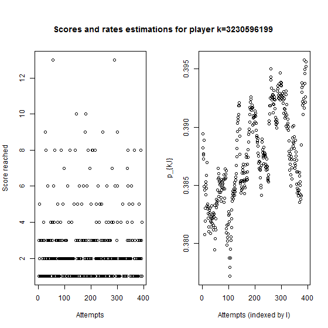

# Description and modeling of FlapMMO score data

FlapMMO is an online game similar to Flappy Bird. The player controls a bird and the aim is to fly as far as possible, avoiding the pipes. At the same time, you see other players playing.

This code provides an exploration of score data collected from this game. For this purpose, descriptive statistics and probabilistic models are tested (code originally written in 2014, and cleaned in 2017).

You can check out the related blog post here: https://ahstat.github.io/Flap-mmo/
or directly see results in the `outputs` folder.

**Some outputs**

*How much time each player continues to play?*
 

*Probability to make a new attempt knowing that n attempts have been done*
 

*Evolution of the score between two consecutive tries*

*Probability to quit after reaching a certain score*

*Evolution of the probability to bang each pipe as a function of the number of attempts**
For each pipe, we assume that player has a probability $p$ to bang this pipe. A lower $p$ indicates skill. As the function of number of attempts, we can show that some players increase their skill quickly, contrary to other ones.

